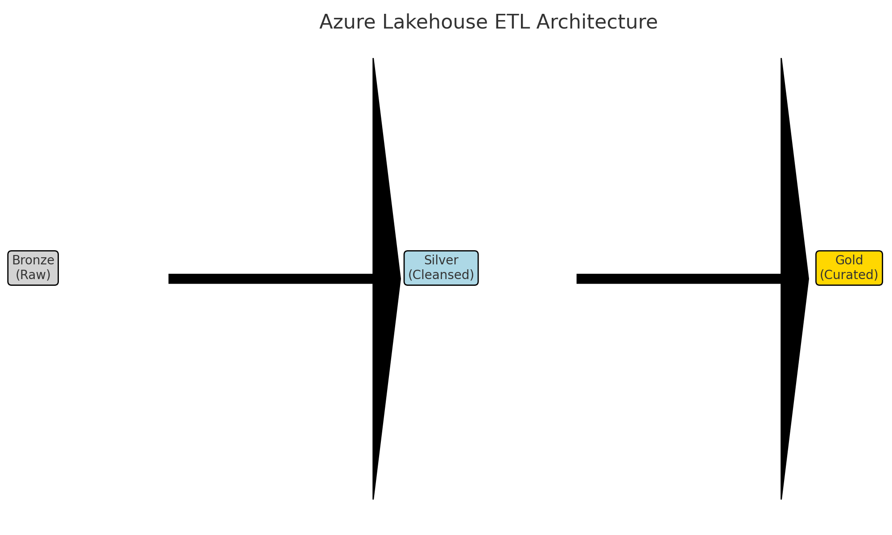

# Azure Lakehouse ETL Framework | MNP Digital

This project demonstrates an enterprise-scale ETL solution using the Microsoft Azure stack to process, transform, and serve multi-client financial data.

## 🔧 Tools Used
- Azure Data Factory (ADF)
- Azure Data Lake Storage Gen2
- Azure Databricks (PySpark)
- Azure Synapse Analytics
- Power BI

## ETL Highlights
- Ingested raw source files into Lakehouse bronze layer via ADF
- Cleaned and validated data using Databricks and PySpark (silver layer)
- Created curated gold layer model for downstream analytics in Power BI
- Scheduled pipelines with data refresh monitoring and alerting
- Designed re-usable ETL framework for multiple clients

## Repo Contents
- `sample_etl_notebook.py`: PySpark logic for silver layer transformation
- `gold_model_schema.md`: Star schema model for gold layer
- `pipeline_overview.md`: Description of ETL flow and framework
- `dataflow_diagram.png`: ETL architecture showing Bronze → Silver → Gold

## Outcome
- Automated and standardized ingestion/processing for financial reporting
- Reduced manual intervention by 70%
- Enabled scalable, client-specific insights in Power BI

## Architecture Diagram

Below is the ETL data flow using the medallion architecture:

